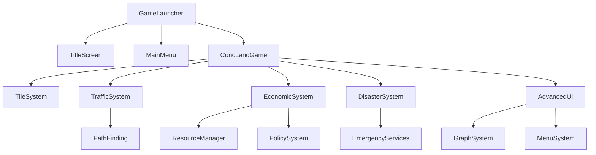

# ConcLand ゲームアーキテクチャドキュメント

## 📚 目次
1. [システム概要](#システム概要)
2. [アーキテクチャ設計](#アーキテクチャ設計)
3. [コア機能](#コア機能)
4. [拡張機能](#拡張機能)
5. [データフロー](#データフロー)
6. [状態管理](#状態管理)
7. [実装状況](#実装状況)

## システム概要

### プロジェクト構造
```
ConcLand/
├── docs/                        # ドキュメント
│   ├── GAME_ARCHITECTURE.md    # このファイル
│   ├── API_REFERENCE.md        # API仕様書
│   └── DEVELOPMENT_GUIDE.md    # 開発ガイド
├── core/                        # コアシステム
│   ├── concland_mini.py        # メインゲームエンジン
│   ├── image_tile_system.py    # タイル描画システム
│   └── train_system.py         # 電車システム
├── systems/                     # ゲームシステム
│   ├── title_menu_system.py    # タイトル・メニュー
│   ├── traffic_system.py       # 交通管理
│   ├── economic_system.py      # 経済管理
│   ├── disaster_system.py      # 災害管理
│   └── advanced_ui.py          # 高度UI
├── data/                        # ゲームデータ
│   ├── economy/
│   │   └── resources.json      # 資源定義
│   ├── scenarios/               # シナリオデータ
│   └── achievements/            # 実績データ
├── assets/                      # アセット
│   ├── tiles/                  # タイル画像
│   ├── icons/                  # アイコン
│   ├── sounds/                 # サウンド
│   └── music/                  # BGM
├── saves/                       # セーブデータ
├── config/                      # 設定ファイル
└── tests/                       # テスト

```

## アーキテクチャ設計

### レイヤー構造

```
┌─────────────────────────────────────────┐
│          Presentation Layer             │
│  (UI, Graphics, Sound, Input/Output)    │
├─────────────────────────────────────────┤
│           Game Logic Layer              │
│  (Rules, Mechanics, AI, Simulation)     │
├─────────────────────────────────────────┤
│            System Layer                 │
│  (State, Resources, Events, Services)   │
├─────────────────────────────────────────┤
│            Data Layer                   │
│  (Save/Load, Config, Assets, Database)  │
└─────────────────────────────────────────┘
```

### モジュール依存関係



## コア機能

### 1. ゲーム起動フロー

```python
# 起動シーケンス
1. GameLauncher.__init__()
   ├── Load UserSettings
   ├── Check Quick Start Options
   │   ├── Skip Title Screen?
   │   ├── Auto Load Last Save?
   │   └── Quick Start Mode?
   ├── Initialize Pyxel
   └── Start Game Loop

2. State Management
   ├── TITLE → MAIN_MENU
   ├── MAIN_MENU → NEW_GAME/LOAD_GAME/OPTIONS
   ├── NEW_GAME → IN_GAME
   └── IN_GAME → PAUSED → MAIN_MENU
```

### 2. セーブ/ロードシステム

#### セーブデータ構造
```python
SaveData = {
    "version": "1.0.0",
    "metadata": {
        "city_name": str,
        "save_date": datetime,
        "play_time": int,
        "population": int,
        "funds": int
    },
    "game_state": {
        "grid": [[CellType]],
        "sim_data": [[SimData]],
        "camera": (x, y),
        "year": int,
        "month": int,
        "day": int
    },
    "systems": {
        "traffic": {...},
        "economic": {...},
        "disaster": {...}
    }
}
```

### 3. ゲームループ

```python
def game_loop():
    while running:
        # Input Phase
        handle_input()
        
        # Update Phase (60 FPS)
        if not paused:
            update_simulation()     # Every frame
            update_traffic()        # Every frame
            update_economy()        # Every 5 frames
            update_disasters()      # Every 3 frames
            update_ui()            # Every frame
        
        # Render Phase
        draw_world()
        draw_buildings()
        draw_overlays()
        draw_ui()
        
        # Frame Control
        pyxel.flip()
        maintain_fps(60)
```

## 拡張機能

### 1. 難易度システム

| 難易度 | 初期資金 | 災害確率 | 成長率 | 維持費 |
|--------|----------|----------|--------|--------|
| Easy | ¥20,000 | 0.01% | 150% | 70% |
| Normal | ¥10,000 | 0.05% | 100% | 100% |
| Hard | ¥5,000 | 0.10% | 70% | 150% |
| Sandbox | ¥999,999 | 0% | 200% | 0% |

### 2. 進行システム

#### レベルアンロック
```
Level 1: 基本建設（道路、RCI、電力）
Level 3: 公共サービス（警察、消防）
Level 5: 教育施設（学校、図書館）
Level 7: 医療施設（病院、診療所）
Level 10: 交通システム（バス、鉄道）
Level 12: 娯楽施設（公園、スタジアム）
Level 15: 経済政策
Level 18: 高度施設（空港、港湾）
Level 20: 特殊建築物
Level 25: メガプロジェクト
```

### 3. 実績システム

#### 実績カテゴリ
- **基本実績**: 人口、GDP、建設数
- **チャレンジ実績**: 特定条件下での達成
- **隠し実績**: 特殊な発見や失敗
- **収集実績**: 全種類の建物建設

## データフロー

### イベントシステム
```
User Input → InputHandler → GameState → Systems → UI Update
                                ↓
                          EventManager
                                ↓
                    [Traffic, Economy, Disaster]
                                ↓
                          StateChange
                                ↓
                          Notification → User
```

### リソースフロー
```
Production → ResourceManager → Market → Consumption
     ↑            ↓                         ↓
  Buildings    Storage                   Citizens
     ↑            ↓                         ↓
  Policies    Trade/Export              Services
```

## 状態管理

### GameState管理

```python
class GameStateManager:
    states = {
        "menu": MenuState,
        "game": GameState,
        "pause": PauseState,
        "options": OptionsState
    }
    
    def transition(from_state, to_state):
        # State transition logic
        from_state.exit()
        to_state.enter()
        current_state = to_state
```

### セッション管理

```python
class SessionManager:
    def __init__(self):
        self.session_id = generate_uuid()
        self.start_time = datetime.now()
        self.auto_save_timer = 0
        self.statistics = GameStatistics()
    
    def auto_save(self):
        if self.auto_save_timer >= AUTO_SAVE_INTERVAL:
            self.save_game("auto_save.dat")
            self.auto_save_timer = 0
```

## 実装状況

### ✅ 完了済み機能

#### コアシステム (100%)
- [x] 基本ゲームエンジン
- [x] タイル描画システム
- [x] RCIゾーニング
- [x] インフラ管理
- [x] セーブ/ロード

#### 拡張システム (100%)
- [x] 交通管理システム
- [x] 経済管理システム
- [x] 災害管理システム
- [x] 高度UIシステム
- [x] タイトル/メニューシステム

### 🚧 実装中機能

#### ゲームプレイ (30%)
- [x] ユーザー設定管理
- [ ] チュートリアルシステム
- [ ] 目標/クエストシステム
- [ ] 実績システム
- [ ] ランキングシステム

#### コンテンツ (20%)
- [ ] マルチシナリオ
- [ ] マップバリエーション
- [ ] シーズンイベント
- [ ] デイリーチャレンジ

#### 演出 (10%)
- [ ] BGMシステム
- [ ] 効果音システム
- [ ] ビジュアルエフェクト
- [ ] アニメーション

### 📝 未実装機能

#### 高度な機能
- [ ] マルチプレイヤー
- [ ] MODサポート
- [ ] シナリオエディタ
- [ ] クラウドセーブ
- [ ] 実績同期

## パフォーマンス目標

### 最小要件
- CPU: 2.0GHz Dual Core
- RAM: 2GB
- Storage: 500MB
- Graphics: OpenGL 2.0対応

### 推奨要件
- CPU: 2.5GHz Quad Core
- RAM: 4GB
- Storage: 1GB
- Graphics: OpenGL 3.0対応

### パフォーマンス指標
- FPS: 60 (安定)
- メモリ使用量: < 500MB
- 起動時間: < 5秒
- セーブ/ロード: < 2秒
- 応答時間: < 100ms

## 開発ガイドライン

### コーディング規約
- PEP 8準拠
- Type Hintsの使用
- Docstringsの記述
- 単体テストの作成

### Git運用
- Feature Branch Workflow
- Semantic Versioning
- Conventional Commits
- Pull Request必須

### テスト方針
- Unit Test Coverage > 80%
- Integration Test必須
- Performance Test定期実施
- User Acceptance Test

## 今後の開発計画

### Phase 1 (現在)
- タイトル/メニューシステム完成
- ユーザー設定管理
- 基本的なゲームフロー

### Phase 2 (次期)
- チュートリアル実装
- 目標システム実装
- バランス調整

### Phase 3
- シナリオ追加
- 実績システム
- サウンド実装

### Phase 4
- 最終調整
- バグ修正
- リリース準備

---

最終更新: 2025-08-19
バージョン: 1.0.0-alpha